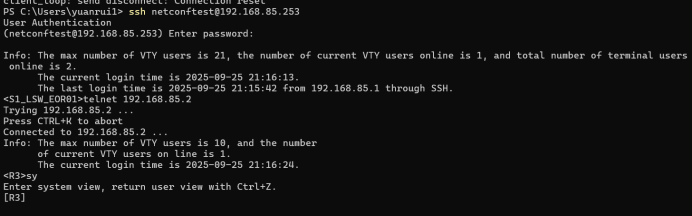
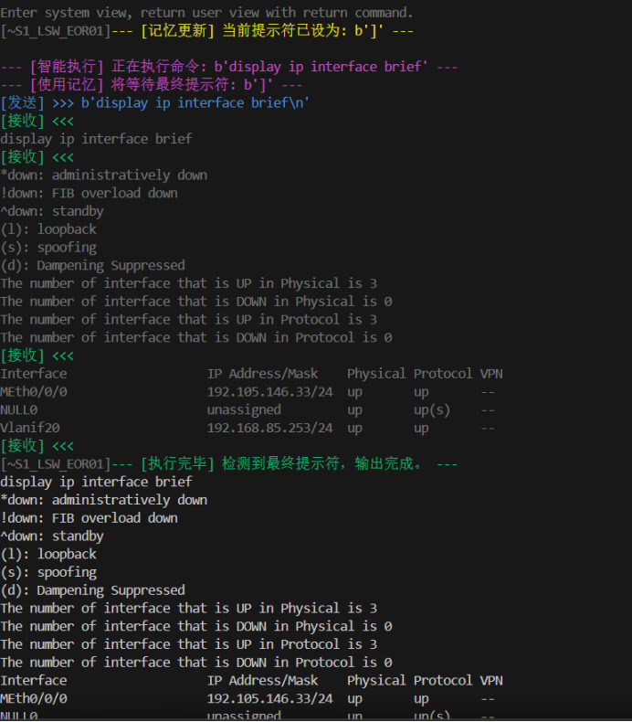

# VisualNetAutomator - 可视化网络自动化交互工具

[](https://opensource.org/licenses/MIT)
[](https://www.python.org/)

一款为网络工程师和NetDevOps初学者设计的、带有彩色高亮和交互记忆功能的SSH/Telnet调试工具。它旨在弥合手动CLI操作与全自动化脚本之间的鸿沟，让自动化过程“看得见、摸得着”。

---

## 🚀 项目亮点 (Key Features)

- **🎨 可视化交互**: 所有发送和接收的数据都带有彩色高亮，清晰区分指令、设备回显和工具日志。
- **🧠 记忆功能**: 自动记忆上一次的设备提示符，简化连续命令的执行，代码更简洁。
- ** SSH & Telnet 双协议支持**: 提供 `VisualSSH` 和 `VisualTelnet` 两个类，无缝切换安全与兼容模式。
- **🔄 自动翻页**: 智能识别并处理华为VRP等系统的`---- More ----`翻页提示，自动发送空格。
- **🧩 模块化设计**: 代码结构清晰，易于理解和扩展，可方便地集成到更大型的自动化项目中。

## ✨ 效果演示 (Screenshots)

为了直观地展示本工具的价值，下面将对比**传统手动SSH**与**使用VisualSSH自动化**两种方式的终端界面。

### 1. 传统终端手动SSH连接
这是我们日常使用的标准SSH客户端（如PowerShell）的界面，信息清晰但缺乏高亮，所有输出都混在一起，不利于快速定位问题。



### 2. 使用 VisualSSH 的自动化连接
这是通过本项目的 `VisualSSH` 工具执行相同操作的输出。可以看到，**发送的指令（蓝色）**、**接收的数据（绿色）**以及**工具的内部状态日志（青色/品红色）**都被清晰地区分，极大地提高了调试效率和可读性。这正是本项目的核心价值所在！



## 🤔 项目背景 (Motivation)

作为一名深入学习华为HCIP的网络工程学生，我深刻理解从命令行（CLI）到自动化编程（NetDevOps）的思维转变过程。在编写Python自动化脚本的初期，我们常常困惑于：
- 脚本到底向设备发送了什么？
- 设备真实地返回了什么？
- 脚本为什么会在某个`read_until`操作卡住？

`VisualNetAutomator`正是为了解决这些痛点而生。它将底层的`paramiko`和`telnetlib`交互过程完全透明化，通过丰富的颜色日志，让我能像看电影一样观察到脚本与网络设备“对话”的每一个细节，极大地提升了自动化脚本的开发和调试效率。

## 🛠️ 技术栈 (Tech Stack)

- **核心语言**: Python 3
- **SSH协议库**: `paramiko`
- **Telnet协议库**: `telnetlib` (Python标准库)
- **终端彩色输出**: `colorama`

## ⚙️ 安装与环境准备 (Installation)

1. **克隆本项目到本地**
   ```bash
   git clone https://github.com/yearsGG/python-automation-learning.git
   cd python-automation-learning
   ```

2. **创建`requirements.txt`文件**
   在项目根目录下创建一个名为 `requirements.txt` 的文件，并写入以下内容：
   ```text
   paramiko
   colorama
   ```

3. **安装依赖**
   ```bash
   pip install -r requirements.txt
   ```

## 📚 如何使用 (Quick Start)

下面是一个使用 `VisualSSH` 连接一台华为设备并执行命令的简单示例 (`main.py`)：

```python
from my_visual_ssh import VisualSSH
from colorama import Fore, Style

# --- 设备连接信息 ---
HOST = '192.168.85.254' 
USER = 'netconftest'      
PASSWORD = 'YourPassword@123' 

# --- 设备提示符信息 ---
USER_PROMPT = b'>'
SYSTEM_PROMPT = b']'

ssh = None
try:
    # 1. 初始化并建立SSH连接
    ssh = VisualSSH(HOST, username=USER, password=PASSWORD)
    
    # 2. 等待用户视图提示符，并存入“记忆”
    ssh.read_until(USER_PROMPT)
    
    # 3. 进入系统视图
    ssh.write(b"system-view")
    
    # 4. 等待系统视图提示符，并更新“记忆”
    ssh.read_until(SYSTEM_PROMPT)

    # 5. 使用execute()方法，它将自动使用记忆中的']'作为结束标志
    output = ssh.execute(b"display ip interface brief")
    print(output)
    
finally:
    # 确保连接被关闭
    if ssh:
        ssh.close()
```

## 🔮 未来计划 (Roadmap)

- [ ] 增加对不同厂商设备提示符的自动识别能力。
- [ ] 将返回的文本结果进行结构化解析。
- [ ] 封装成一个更易于安装和分发的Python包。

## 许可证 (License)

本项目采用 [MIT](https://opensource.org/licenses/MIT) 许可证。

## 👤 关于作者 (About Me)

- **姓名**: 袁瑞
- **GitHub**: [@yearsGG](https://github.com/yearsGG)
- **邮箱**: rui.yuan.net@yearsgg.online

<!-- 别忘了把上面的GitHub链接和邮箱换成你自己的！ -->